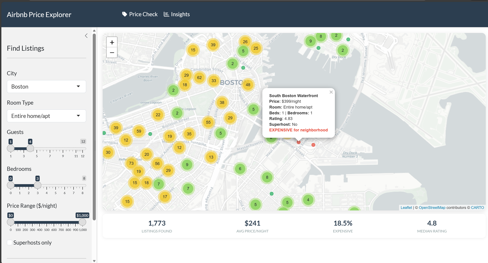
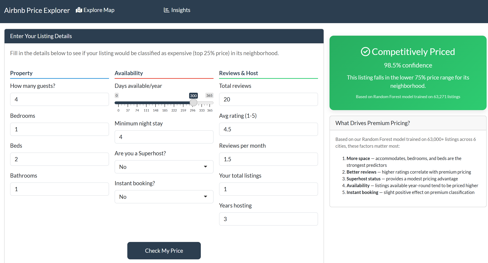
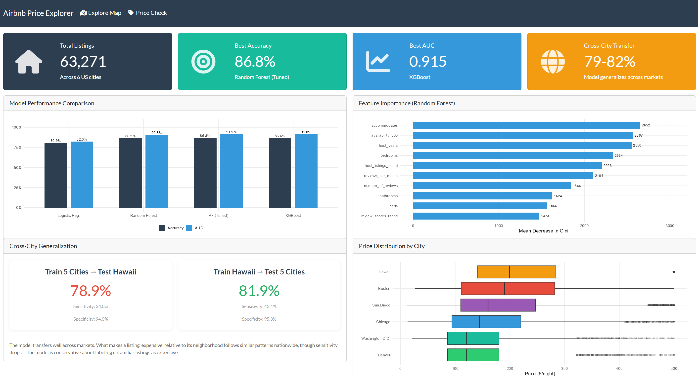

<div align="center">

# 🏠 Airbnb Price Explorer

### What Makes an Airbnb Listing Expensive — and Is It the Same Across US Cities?


**A machine learning system that predicts whether an Airbnb listing is priced in the top 25% for its neighborhood, trained on 63,000+ listings across 6 US cities — with an interactive map dashboard and live price predictor.**

</div>

---

## 🎯 The Problem

New Airbnb hosts don't know if they're overpricing or underpricing their listing. Travelers can't tell if a listing is a good deal for its neighborhood. Raw price comparisons are misleading — a $200/night listing in a budget neighborhood means something very different than $200/night in a premium area.

**This project answers:** Given a listing's features (size, reviews, host experience, availability), can we predict whether it commands premium pricing relative to its neighborhood? And do the same factors drive premium pricing in Boston, Chicago, Hawaii, and beyond?

## 📊 Dataset

| Detail | Value |
|--------|-------|
| **Source** | [Inside Airbnb](http://insideairbnb.com) (open data) |
| **Cities** | Boston, Chicago, Washington D.C., Hawaii, Denver, San Diego |
| **Total Listings** | 63,271 after cleaning |
| **Features** | 45 columns including property details, host info, reviews, availability |
| **Target Variable** | `is_expensive` — top 25% price within each neighborhood |

## ⚙️ Project Pipeline

```
Raw Data (6 cities)
    │
    ▼
Preprocessing ──── Clean prices, parse bathrooms, engineer features
    │                (host_years, ppl_per_bedroom, availability_category)
    ▼
EDA & Statistics ── Welch's t-tests, Chi-square, ANOVA, effect sizes,
    │                correlation analysis, multicollinearity checks
    ▼
Modeling ────────── Logistic Regression, Random Forest, XGBoost
    │                with 5-fold CV and hyperparameter tuning
    ▼
Evaluation ──────── Cross-city generalization testing
    │                (Train on 5 cities → Test on 6th)
    ▼
Dashboard ───────── Interactive Shiny app with Leaflet map,
                     live price predictor, and model insights
```

## 🏆 Results

### Model Comparison

| Model | Accuracy | Sensitivity | Specificity | AUC |
|-------|----------|-------------|-------------|-----|
| Logistic Regression | 80.9% | 41.8% | 94.2% | 0.823 |
| Random Forest | 86.3% | 60.7% | 95.1% | 0.908 |
| **Random Forest (Tuned)** | **86.8%** | **64.5%** | **94.4%** | **0.912** |
| XGBoost | 86.6% | 63.6% | 94.4% | **0.915** |

### Cross-City Generalization

| Experiment | Accuracy | Sensitivity | Specificity |
|-----------|----------|-------------|-------------|
| Train on 5 cities → Test on Hawaii | 78.9% | 34.0% | 94.0% |
| Train on Hawaii → Test on 5 cities | 81.9% | 43.1% | 95.3% |

The model transfers reasonably well across markets — what makes a listing "expensive" relative to its neighborhood follows similar patterns nationwide. However, sensitivity drops in cross-city testing, suggesting some city-specific pricing dynamics that a national model misses.

### Top Predictive Features

Based on Mean Decrease in Gini from the Random Forest model:

1. **Accommodates** — more guests = higher price tier
2. **Availability (365)** — year-round listings tend to be pricier
3. **Host years** — experienced hosts command premium pricing
4. **Bedrooms** — more space = premium classification
5. **Host listings count** — professional hosts price differently

## 🖥️ Interactive Dashboard

The Shiny dashboard has three tabs designed for different users:

### Explore Map
Browse listings on an interactive Leaflet map. Filter by city, room type, guests, bedrooms, and price. Green dots = affordable, red dots = expensive. Click any listing for details.

<div align="center">

<br><em>Select a city → filter by your preferences → see which listings are expensive for their neighborhood</em>
</div>

### Price Check
Enter your listing details and get an instant prediction: is your listing priced in the premium tier? Adjust inputs to see what would push your listing into (or out of) the top 25%.

<div align="center">

<br><em>Enter listing details → get instant prediction with confidence score</em>
</div>

### Insights
Model performance comparison, feature importance, cross-city generalization results. For anyone interested in the technical methodology.

<div align="center">

<br><em>Model comparison, feature importance, and cross-city generalization results</em>
</div>

## 🚀 Getting Started

### Prerequisites

- **R** ≥ 4.4
- Required packages: `tidyverse`, `shiny`, `bslib`, `leaflet`, `randomForest`, `xgboost`, `caret`, `DT`

### Installation

```bash
# Clone the repository
git clone https://github.com/yourusername/airbnb-price-explorer.git
cd airbnb-price-explorer

# Install R dependencies
Rscript -e "install.packages(c('tidyverse', 'shiny', 'bslib', 'leaflet', 'randomForest', 'xgboost', 'caret', 'DT', 'pROC', 'corrplot'))"
```

### Run the Analysis

```r
# Step 1: Download data from InsideAirbnb
source("01_data_collection.R")

# Step 2: Clean and engineer features
source("02_preprocessing.R")

# Step 3: Exploratory analysis and statistical tests (open in RStudio and knit)
# 03_eda_and_statistics.Rmd

# Step 4: Model training and evaluation (open in RStudio and knit)
# 04_modeling.Rmd

# Step 5: Launch the interactive dashboard
shiny::runApp("05_dashboard.R")
```

## 📁 Repository Structure

```
airbnb-price-explorer/
├── README.md
├── LICENSE
├── .gitignore
│
├── 01_data_collection.R          # Downloads data from InsideAirbnb for 6 cities
├── 02_preprocessing.R            # Cleaning, feature engineering, target variable creation
├── 03_eda_and_statistics.Rmd     # EDA with statistical hypothesis testing
├── 04_modeling.Rmd               # Model training, tuning, evaluation, cross-city testing
├── 05_dashboard.R                # Interactive Shiny dashboard with Leaflet map
├── utils.R                       # Helper functions used across scripts
│
├── data/
│   ├── raw/                      # Original InsideAirbnb CSV files (not tracked in git)
│   └── processed/                # Cleaned dataset (not tracked in git)
│
└── models/                       # Saved trained models (not tracked in git)
```

## 🔬 Statistical Methods

This project goes beyond basic ML modeling to include rigorous statistical analysis:

- **Welch's t-tests** — comparing expensive vs. non-expensive listings on continuous features
- **Chi-square tests** — testing association between categorical features and price classification
- **One-way ANOVA with post-hoc analysis** — comparing metrics across cities
- **Effect size calculations** — Cohen's d and Cramér's V to measure practical significance
- **Correlation analysis** — identifying relationships between features
- **Multicollinearity checks** — VIF analysis to ensure model stability
- **5-fold cross-validation** — for hyperparameter tuning
- **Cross-city generalization testing** — train/test split by geography

## 🔮 Future Improvements

- **Natural Language Processing** — analyze listing descriptions and review text for pricing signals
- **Seasonal pricing** — incorporate time-of-year trends
- **Image analysis** — use listing photos as features (quality, brightness, staging)
- **Deploy dashboard** — host on shinyapps.io for public access

## 📄 License

This project is licensed under the MIT License — see the [LICENSE](LICENSE) file for details.

---

<div align="center">

**Data sourced from [Inside Airbnb](http://insideairbnb.com) — an independent, open source project.**

</div>